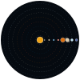

# My SVG files

## Files

| File | Description | Preview |
| --- | --- | --- |
| `solarsystem.svg` | A simple SVG file of the solar system. |  |
| `rainbow.svg` | A simple SVG file of a rainbow. |  |
| `girl-purple-dress.svg` | A simple SVG file of a handdrawn girl with a purple dress. |  |
